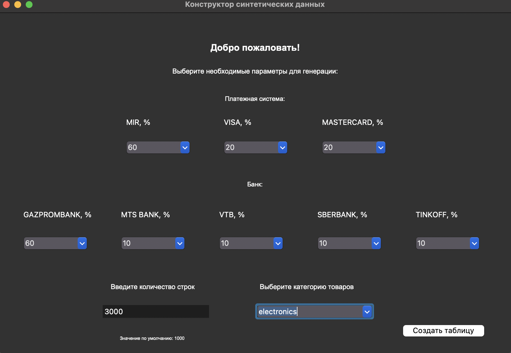

# Генерация синтетического датасета покупок в магазине

## Описание программы

Данная программа предназначена для генерации синтетического датасета покупок в магазинах. Генерируемый датасет содержит информацию о покупках, включающую название магазина, координаты, категорию товара, бренд, номер карты, количество товаров и стоимость. Программа предоставляет возможность настройки каждого свойства в соответствии с техническим заданием.

## Требования к системе

- Python 3.x
- Библиотеки, указанные в файле `requirements.txt`:
  - tkinter (для графического интерфейса)
  - другие зависимости при необходимости

## Техническое задание

### A. Сгенерировать датасет, в котором будут следующие наборы свойств:

1. **Название магазина** — "М.Видео".
2. **Координаты** — два столбца: дата и время + долгота и широта (например, 2020-01-22T08:30:00 и 59.881653, 29.830170).
3. **Категория** — "ноутбук".
4. **Бренд** — "Lenovo".
5. **Номер карточки** — "1234 5678 1234 5678".
6. **Количество товаров** — 1 штука.
7. **Стоимость** — 50 000 руб.

### B. Дополнительная информация по каждому свойству для магазинов Санкт-Петербурга:

1. **Название магазина** — генерируется из словаря магазинов (минимум 30 вариантов).
2. **Координаты и время** — генерируются на основе реального местоположения магазина в городе.
3. **Категория** — настраивается в зависимости от тематики магазина.
4. **Бренд** — настраивается согласно категории товаров в магазине.
5. **Номер карточки** — можно настроить банк (Сбербанк, Газпромбанк и т.д.) и платежную систему (Visa, MasterCard и т.д.), а также количество покупок с одной карты.
6. **Количество товаров** — свободная генерация количества.
7. **Стоимость** — рассчитывается на основе средней стоимости товаров.

### C. Ограничения датасета:

1. Датасет должен содержать минимум **50 000 строк**.
2. **Название магазина** должно быть выбрано из словаря, который включает минимум 30 магазинов.
3. **Координаты**:
   - Округляются до 6 знаков после запятой.
   - Время посещения актуализируется в рамках времени работы магазина: с 10:00 до 22:00.
4. **Категория** — список из минимум 50 категорий.
5. **Бренд** — список из минимум 500 брендов.
6. **Номер карты** — повторяется не более 5 раз.
7. **Количество товаров** — минимум 5 товаров.
8. **Стоимость** — ошибки при пустых или нулевых значениях.

## Установка и запуск

1. Установите зависимости:
   ```bash
   pip install -r requirements.txt
   ```

2. Запустите программу:
   ```bash
   python main.py
   ```

3. Следуйте инструкциям на экране для настройки параметров генерации датасета.

## Инструкция по использованию

1. В интерфейсе программы можно выбрать параметры для генерации: 
   - Платежную систему и банк
   - Количество синтетических данных для генерации
   
2. После выбора необходимых параметров, нажмите кнопку **Генерировать**, чтобы создать датасет.

3. Сгенерированные данные сохранятся в текстовый файл с указанием времени создания.

## Пример использования

- Программа позволяет сгенерировать датасет для 1000000 покупок, которые содержат данные о различных магазинах Санкт-Петербурга, с возможностью настройки количества товаров, брендов и других параметров.

## Пример вывода (csv файл)

| Магазин    | Координаты          | Дата и время       | Товар      | Бренд   | Карта          | Количество | Сумма |
|------------|---------------------|--------------------|------------|---------|----------------|------------|-------|
| Ситилинк   | 60.027797, 30.635243 | 2024-10-01T15:03 | саундбар   | samsung | 2200 5620 1494 2027 | 1          | 12143 |
| Перекрёсток | 59.993683, 30.151735 | 2024-10-25T16:13 | конфеты    | Mars    | 2200 7065 6668 9515 | 3          | 318   |

## Лицензия

Данная программа является открытой и доступна для свободного использования.